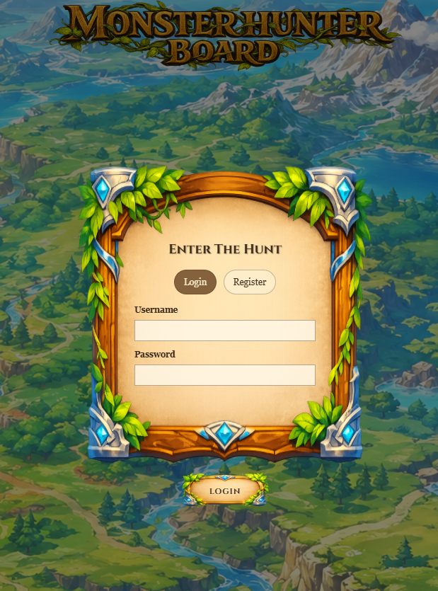
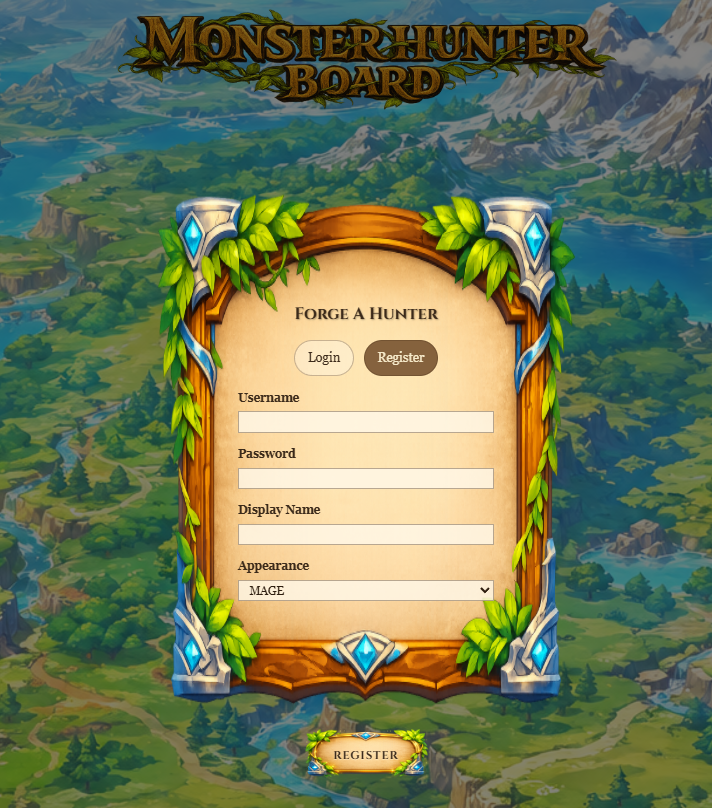
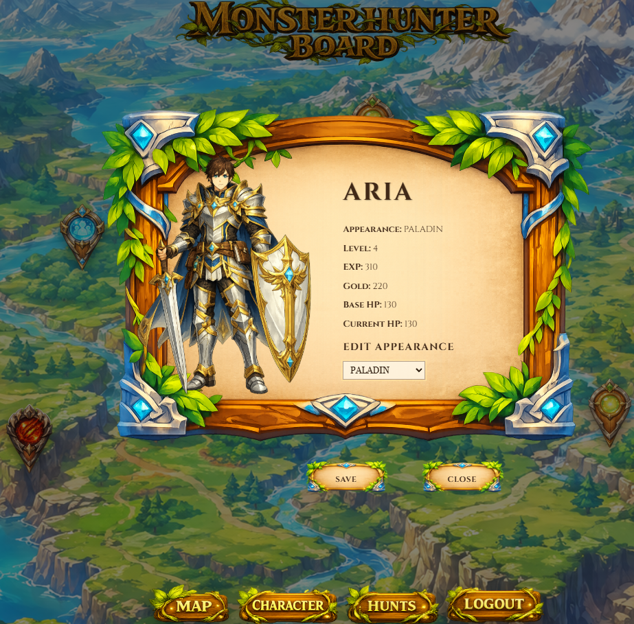
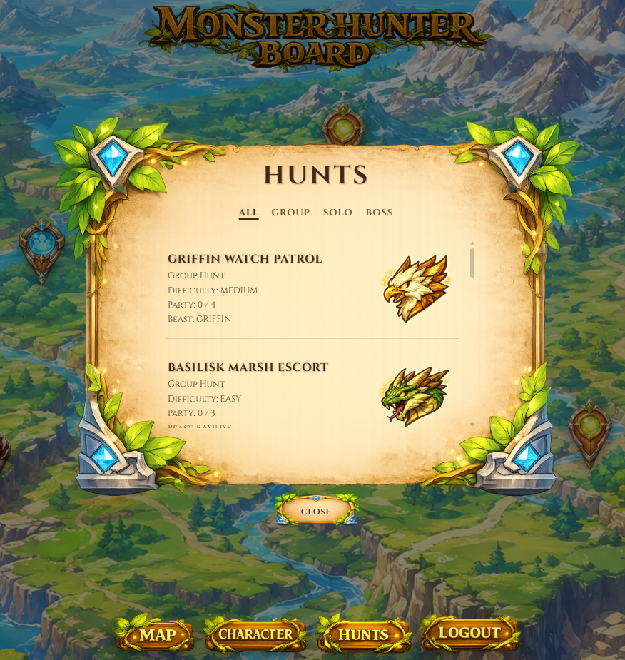
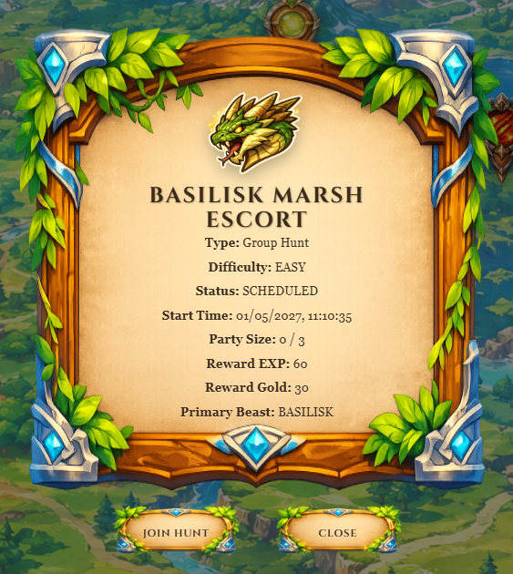
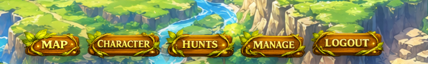
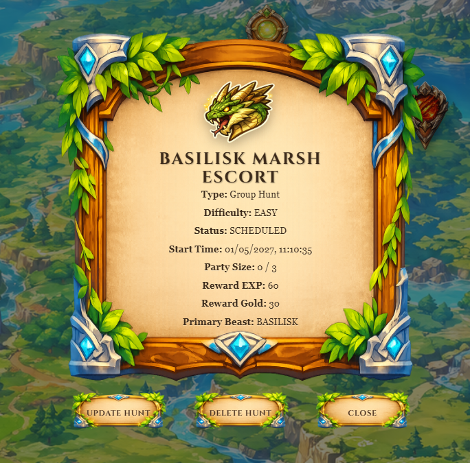
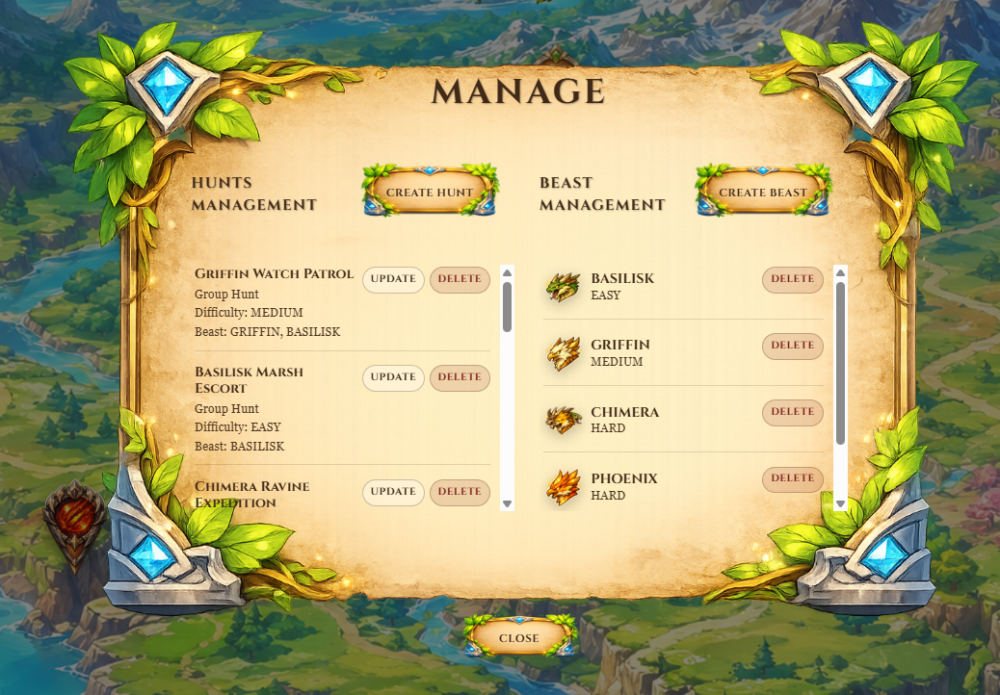
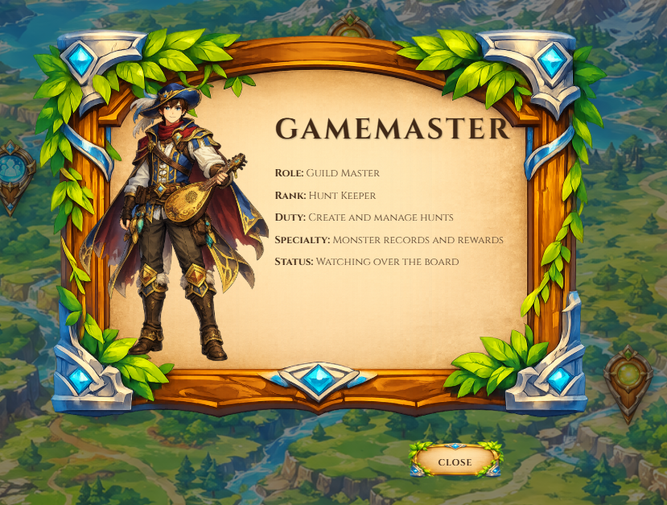

# Intended Layout Design

This document shows how the frontend is intended to look on my computer.
If the layout appears different on another screen, browser, zoom level, or operating system, these screenshots should be used as the visual reference for the intended design.

### Login

### Register

### Hunter Board

### Hunter Character

### Hunts

### Pin To Hunt Modal

### Game Master Menu

### Game Master Pin To Hunt Modal

### Manage Panel

### Game Master Character

